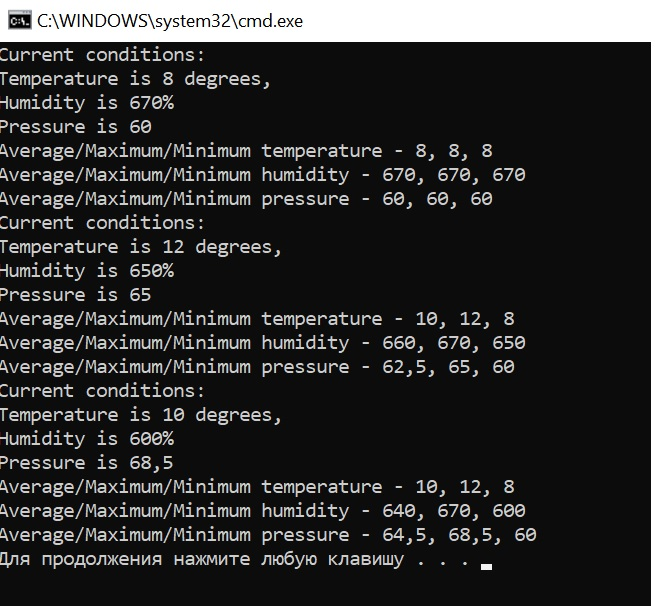
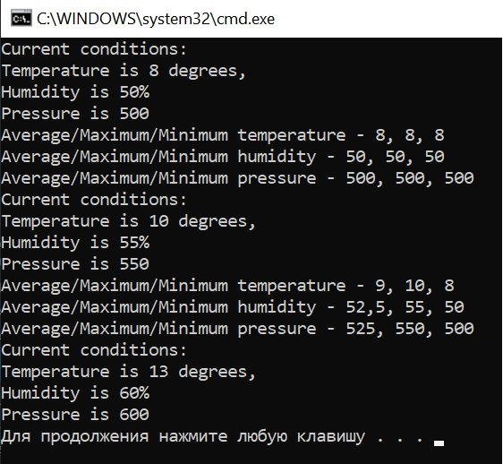
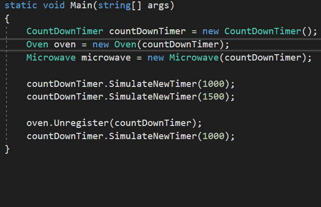

## Задачи
:heavy_check_mark: 1. Метеостанция WeatherStation работает на базе запатентовнного объекта WeatherData, отслеживающего текущие погодные условия (температура (Temperature), влажность (Humidity), атмосферное давление (Pressure)).

* Разработать систему классов для создания текущей сводки (CurrentConditionsReport) и статистики (StatisticReport). Все данные должны обновляться в режиме реального времени, по мере того, как объект WeatherData получает данные последних изменений.
* Предложить два варианта решения (интерфейсы + event)
* Смоделировать работу метеостанции в консольном приложении.

Interface approach: go to [WeatherStationSystem(Interfaces)](https://github.com/UltramarineDev/NET1.S.2019.Sokolova.17/tree/master/WeatherStationSystem(Interfaces))

Event approach: go to [WeatherStationSystem(Events)](https://github.com/UltramarineDev/NET1.S.2019.Sokolova.17/tree/master/WeatherStationSystem(Events))

:heavy_check_mark: 2. Разработать класс для имитации часов с обратным отсчетом (только через event), реализующий возможность по истечении назначенного времени (время ожидания предоставляется классу пользователем) передавать сообщение и дополнительную информацию о событии любому подписавшемуся на событие типу. Продемонстрировать работу класса в консольном приложении. 
go to [CountDownSystem](https://github.com/UltramarineDev/NET1.S.2019.Sokolova.13/blob/master/CountDownSystem)

